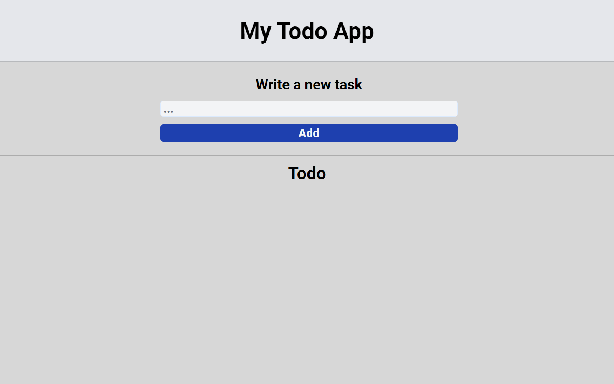

# react-intro

In this project, you will find a todo list app made in React and Tailwind. This project was used to learn about this library and this framework.

---

Project completed

This repository was created February 28, 2023. This project is an exercise realized during the training web developer junior given by Becode.org

---

## Language

- React
- Tailwind

---

## How to install the repository locally

1. create a local working folder
2. open Git Bash
3. clone the repository
4. npm install
5. now you can work on the file

---

[Link to my deploy project.](https://todo-app-react-woad-nu.vercel.app)
